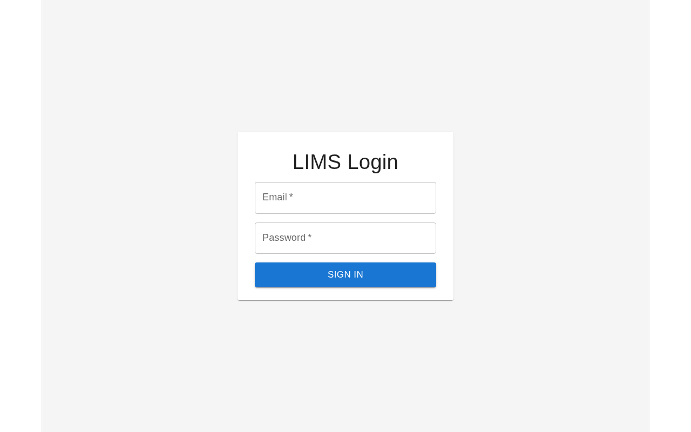
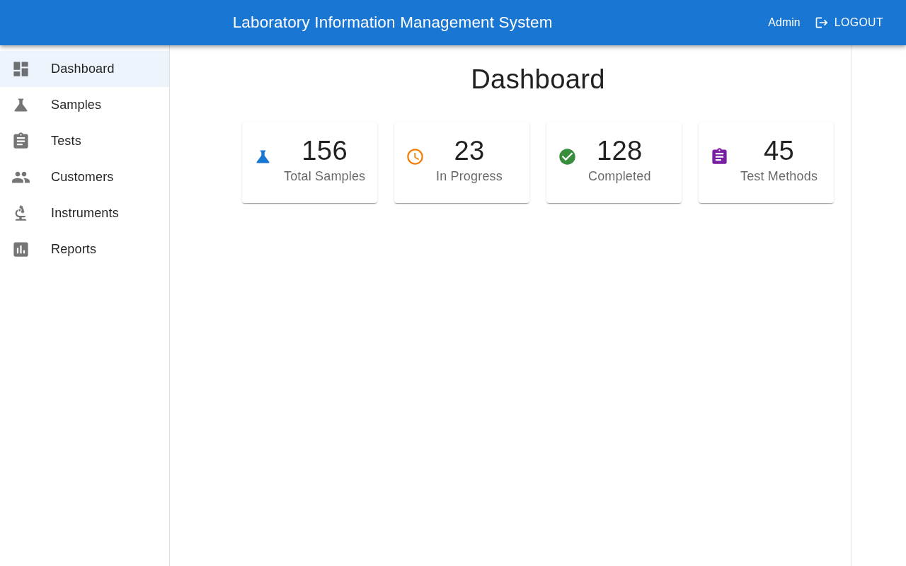
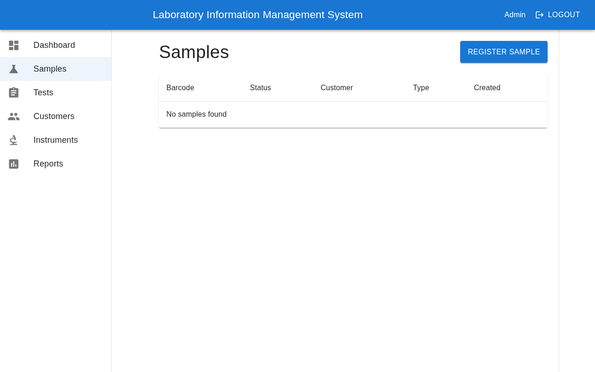
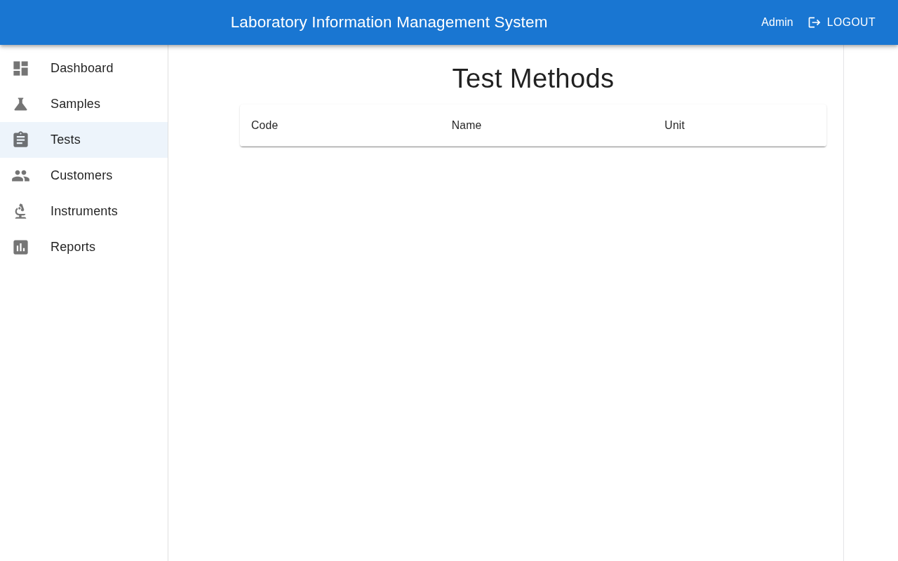
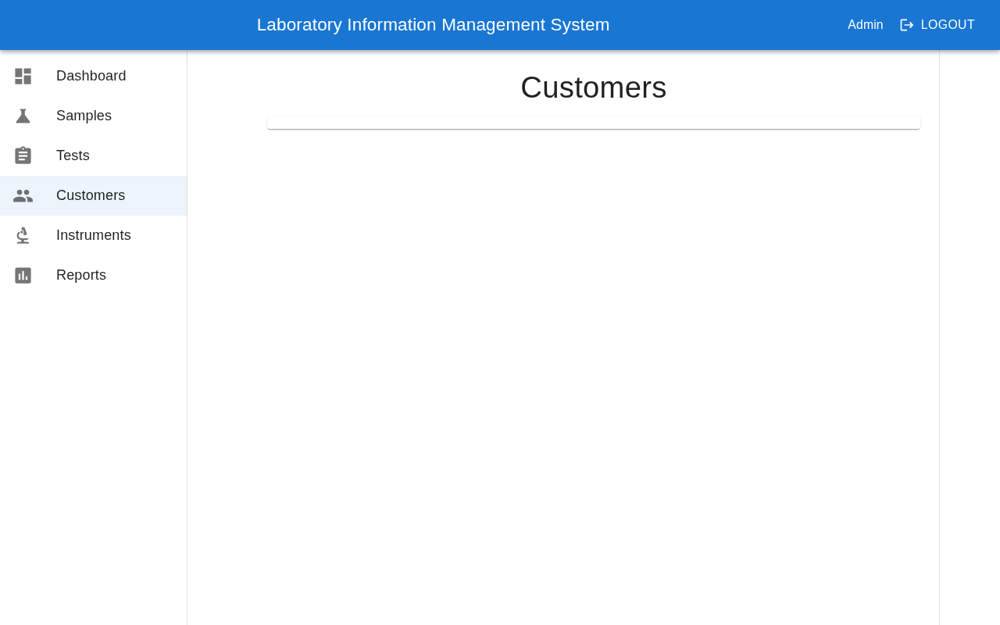
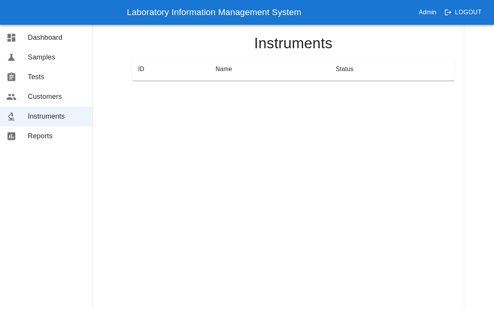
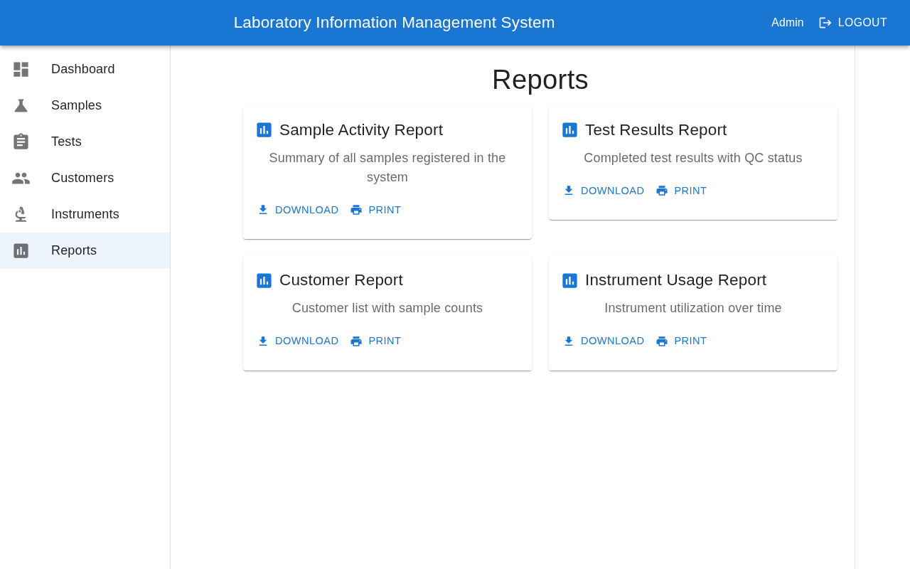

# LIMS — Laboratory Information Management System

Full-stack LIMS на Symfony 6.4 + React 19 + PostgreSQL 15.

## Стек

| Компонент | Технология |
|-----------|-----------|
| Backend | Symfony 6.4, PHP 8.2 |
| API | API Platform 4.3, OpenAPI |
| Frontend | React 19, TypeScript, Vite 8 |
| UI Kit | MUI 6 |
| State | TanStack Query, Zustand |
| DB | PostgreSQL 15 (DDEV) |
| Auth | JWT (LexikJWTAuthenticationBundle) |
| Cache | Redis |

## Учётные данные

| Роль | Email | Пароль |
|------|-------|--------|
| Администратор | `admin@lims.local` | `admin123` |
| Лаборант | `operator@lims.local` | `operator123` |

## Скриншоты

### Логин


### Дашборд


### Образцы


### Методы тестов


### Клиенты


### Оборудование


### Отчёты


## API

```bash
# DDEV
ddev start

# Backend (автоматически)
https://lims.ddev.site

# Frontend (Vite dev server, автоматически)
https://lims.ddev.site:5174
```

## API Endpoints

| Path | Method | Описание | Auth |
|------|--------|----------|------|
| `/api/login` | POST | JWT логин | Нет |
| `/api/me` | GET | Текущий пользователь | JWT |
| `/api/docs` | GET | API документация (Hydra) | Нет |
| `/api/customers` | GET/POST | Клиенты | JWT |
| `/api/samples` | GET/POST | Образцы | JWT |
| `/api/samples/{id}` | GET/PATCH | Образец | JWT |
| `/api/sample_tests` | GET/POST | Тесты образцов | JWT |
| `/api/test_methods` | GET | Методы тестов | JWT |
| `/api/sample_types` | GET | Типы образцов | JWT |
| `/api/instruments` | GET | Оборудование | JWT |
| `/api/users` | GET/POST | Пользователи | JWT |
| `/health` | GET | Health check | Нет |
| `/api/health` | GET | Health check | Нет |
| `/api/reports/sample-activity` | GET | Образцы по дням + статусы | JWT |
| `/api/reports/test-results` | GET | Тесты по методам + статусы | JWT |
| `/api/reports/customer-summary` | GET | Клиенты с количеством образцов | JWT |
| `/api/reports/instrument-status` | GET | Статус калибровки оборудования | JWT |

## Структура

```
├── .ddev/                    # DDEV конфигурация
├── src/
│   ├── Controller/
│   │   ├── ApiController.php       # Health check
│   │   ├── SecurityController.php  # Login / Me
│   │   └── ReportController.php    # Analytics reports
│   ├── Entity/               # Doctrine сущности
│   └── Repository/           # Doctrine репозитории
├── config/
│   └── packages/
│       └── security.yaml     # JWT firewall
├── frontend/
│   └── src/
│       ├── api/              # API клиент и endpoints
│       ├── components/       # Общие компоненты
│       ├── pages/            # Страницы
│       └── store/            # Zustand store
├── public/
├── screenshots/              # Скриншоты
└── migrations/               # Doctrine миграции
```

## License

Proprietary — for internal use only.
